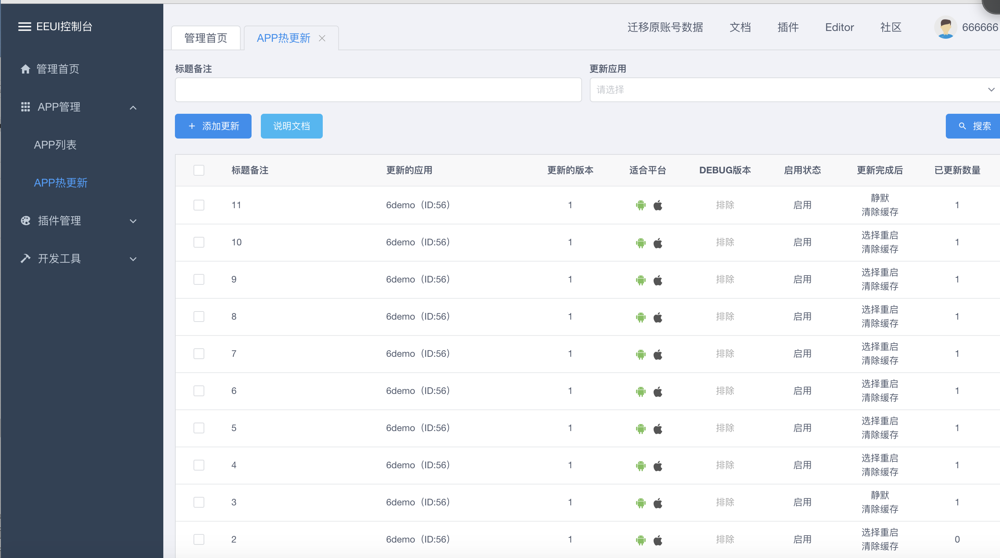

<!--
 * @version: v0.0.1
 * @Author: hailong.chen
 * @Date: 2019-10-06 13:40:31
 * @LastEditors: hailong.chen
 * @LastEditTime: 2019-10-07 16:02:27
 * @Descripttion: 
 -->
1. 文档错误 text-align:center；写错了
- 下载缓慢
  需从github下载模版， eeui setting 进行配置，配置完成后，检测eeui版本信息为undefined  需要在项目目录下进行 eeui update
- 运行，真机调试，遇到 update require,需用 eeui.app点击DEV 进行DEV，配置ip和端口
- 样式：常用的css样式发生显示，缩写基本上不支持，
- 所有页面的样式为隔离状态，无需scope
- 创建页面后自动生成路由，这个有限制，需要重新npm run dev ，否则会遇到页面跳转一直处于loading状态，log输出正常
- 打包(android)
- 创建 build.sh
```bash

#!/bin/bash

npm run build
cd ./platforms/android/eeuiApp
./gradlew clean
./gradlew assembleRelease
cd ../../../
open ./platforms/android/eeuiApp/app/build/outputs/apk/release/

```
- 热修复，使用命令修复，就没有提示修复了
- 
## 热修复包

 * (手动压缩，然后解压，看不出来变化，完全一致，但到手机上，查看文件管理)


* 创建hot.sh

```bash
#!/bin/bash

######### 有问题的命令 ##########
# npm run build
# cd ./common
# zip -r data.zip dist/*
######## 正常更新的命令 ##########
npm run build
cd ./common/dist
# 删除旧的压缩包
rm data.zip
# 压缩新的压缩包
zip -r data.zip ./*
# 移动压缩包位置
mv ./data.zip ../热更新.zip
open ./
cd ../
######## 正常更新的命令 ##########
```

* 执行 $ sh hot.sh


* 将热更新.zip上传到 console.eeui




