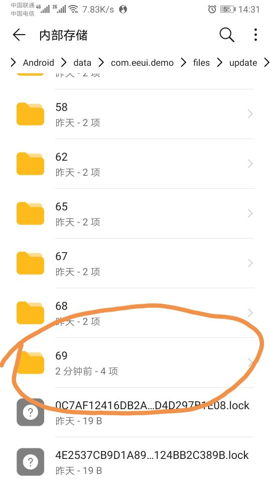
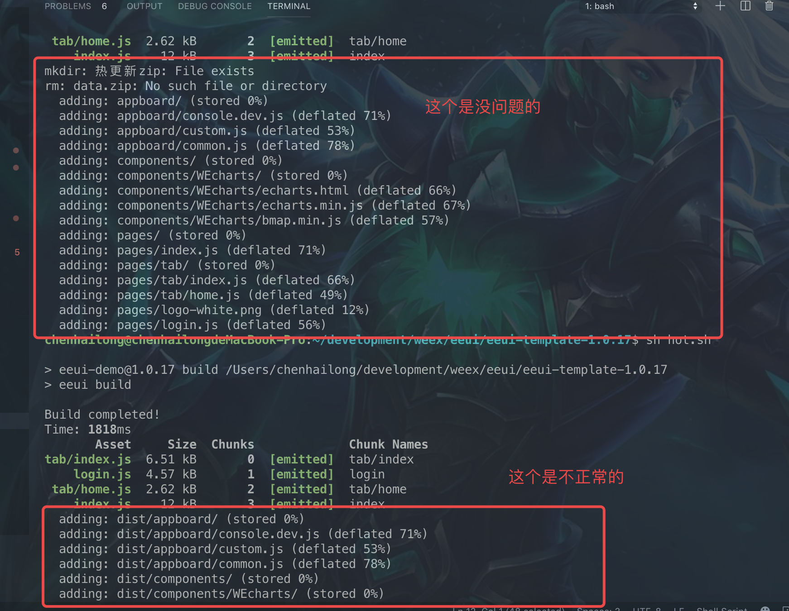
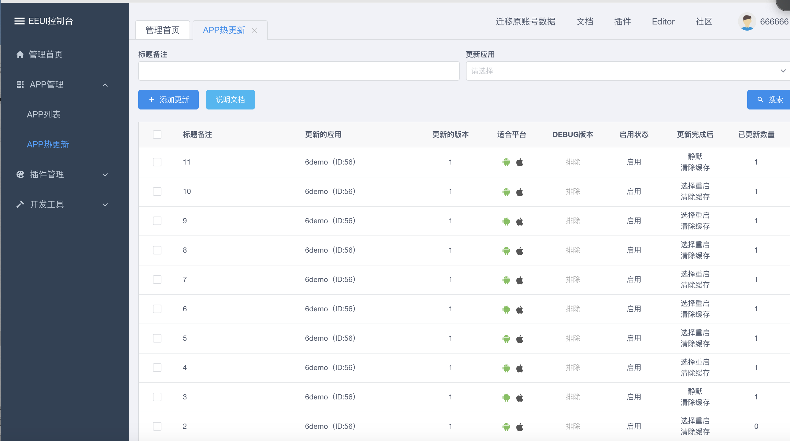

<!--
 * @version: v0.0.1
 * @Author: hailong.chen
 * @Date: 2019-10-06 13:40:31
 * @LastEditors: hailong.chen
 * @LastEditTime: 2019-10-07 15:49:29
 * @Descripttion: 
 -->
1. 文档错误 text-align:center；写错了
- 下载缓慢
  需从github下载模版， eeui setting 进行配置，配置完成后，检测eeui版本信息为undefined  需要在项目目录下进行 eeui update
- 运行，真机调试，遇到 update require,需用 eeui.app点击DEV 进行DEV，配置ip和端口
- 样式：常用的css样式发生显示，缩写基本上不支持，
- 所有页面的样式为隔离状态，无需scope
- 创建页面后自动生成路由，这个有限制，需要重新npm run dev ，否则会遇到页面跳转一直处于loading状态，log输出正常
- 打包(android)
- 创建 build.sh
```bash

#!/bin/bash

npm run build
cd ./platforms/android/eeuiApp
./gradlew clean
./gradlew assembleRelease
cd ../../../
open ./platforms/android/eeuiApp/app/build/outputs/apk/release/

```
- 热修复，使用命令修复，就没有提示修复了
- 
## 热修复包

 * (手动压缩，然后解压，看不出来变化，完全一致，但到手机上，查看文件管理)


* 创建hot.sh

```bash
#!/bin/bash

######### 有问题的命令 ##########
# npm run build
# cd ./common
# zip -r data.zip dist/*
######## 正常更新的命令 ##########
npm run build
cd ./common/dist
# 删除旧的压缩包
rm data.zip
# 压缩新的压缩包
zip -r data.zip ./*
# 移动压缩包位置
mv ./data.zip ../热更新.zip
open ./
cd ../
######## 正常更新的命令 ##########
```

* 执行 $ sh hot.sh




* 将热更新zip下的data.zip上传到 console.eeui




<!--
 * @version: v0.0.1
 * @Author: hailong.chen
 * @Date: 2019-10-06 20:10:23
 * @LastEditors: hailong.chen
 * @LastEditTime: 2019-10-06 20:10:23
 * @Descripttion: 
 -->
<template>
    <div>
        <gcanvas ref="canvas_1" style="width:750px;height:400px;"></gcanvas>
        <gcanvas ref="canvas_2" style="width:750px;height:400px;" @panmove="touchstart" @panend="touchend"></gcanvas>
        <gcanvas ref="canvas_3" style="width:750px;height:400px;"></gcanvas>
    </div>
</template>
<script>
    import {enable, WeexBridge, Image as GImage} from "gcanvas.js";
    import F2 from '../../components/f2Charts/chart';
    const data1 = [
        {genre: '2018-03-05', sold: 275},
        {genre: '圆通', sold: 115},
        {genre: '装载率', sold: 120},
        {genre: 'Shooter', sold: 350},
        {genre: 'Other', sold: 150},
    ];
    const data2 = [{
        time: '2016-08-08 00:00:00',
        tem: 10
    }, {
        time: '2016-08-08 00:10:00',
        tem: 22
    }, {
        time: '2016-08-08 00:30:00',
        tem: 20
    }, {
        time: '2016-08-09 00:35:00',
        tem: 26
    }, {
        time: '2016-08-09 01:00:00',
        tem: 20
    }, {
        time: '2016-08-09 01:20:00',
        tem: 26
    }, {
        time: '2016-08-10 01:40:00',
        tem: 28
    }, {
        time: '2016-08-10 02:00:00',
        tem: 20
    }, {
        time: '2016-08-10 02:20:00',
        tem: 18
    }];
    const data3 = [{
        name: '芳华',
        percent: 0.4,
        a: '1'
    }, {
        name: '妖猫传',
        percent: 0.2,
        a: '1'
    }, {
        name: '机器之血',
        percent: 0.18,
        a: '1'
    }, {
        name: '心理罪',
        percent: 0.15,
        a: '1'
    }, {
        name: '寻梦环游记',
        percent: 0.05,
        a: '1'
    }, {
        name: '其他',
        percent: 0.02,
        a: '1'
    }];
    export default {
        data() {
            return {
                chart: null,
                timeStamp: 0
            };
        },
        mounted: function () {
            this.setBarChart();
            this.setLineChart();
            this.setPieChart();
        },
        methods: {
            setBarChart() {
                let ref = this.$refs.canvas_1;
                ref = enable(ref, {bridge: WeexBridge});
                let ctx = ref.getContext("2d");
                const canvas = new F2.Renderer(ctx);
                const chart = new F2.Chart({
                    el: canvas, // 将第三步创建的 canvas 对象的上下文传入
                    width: 750, // 必选，图表宽度，同 canvas 的宽度相同
                    height: 400 // 必选，图表高度，同 canvas 的高度相同
                });
                chart.source(data1);

                // Step 3：创建图形语法，绘制柱状图，由 genre 和 sold 两个属性决定图形位置，genre 映射至 x 轴，sold 映射至 y 轴
                chart.interval().position('genre*sold').color('genre');
                chart.legend('genre', {
                    marker: {
                        radius: 6 // 半径大小
                    }
                });

                // Step 4: 渲染图表
                chart.render();
            },
            setLineChart() {
                let ref = this.$refs.canvas_2;
                ref = enable(ref, {bridge: WeexBridge});
                let ctx = ref.getContext("2d");
                const canvas = new F2.Renderer(ctx);
                const chart = new F2.Chart({
                    el: canvas, // 将第三步创建的 canvas 对象的上下文传入
                    width: 750, // 必选，图表宽度，同 canvas 的宽度相同
                    height: 400 // 必选，图表高度，同 canvas 的高度相同
                });
                this.chart = chart;
                let defs = {
                    time: {
                        type: 'timeCat',
                        mask: 'MM/DD',
                        range: [0, 1]
                    },
                    tem: {
                        tickCount: 5,
                        min: 0,
                        alias: '日均温度'
                    }
                };
                chart.source(data2, defs);
                chart.axis('time', {
                    label: function label(text, index, total) {
                        var textCfg = {};
                        if (index === 0) {
                            textCfg.textAlign = 'left';
                        } else if (index === total - 1) {
                            textCfg.textAlign = 'right';
                        }
                        return textCfg;
                    }
                });
                chart.tooltip({
                    showCrosshairs: true
                });
                chart.line().position('time*tem').shape('smooth').size(4);
                chart.point().position('time*tem').shape('smooth').size(5).style({
                    stroke: '#fff',
                    lineWidth: 2
                });
                chart.render();
            },
            setPieChart() {
                let map = {
                    '芳华': '40%',
                    '妖猫传': '20%',
                    '机器之血': '18%',
                    '心理罪': '15%',
                    '寻梦环游记': '5%',
                    '其他': '2%'
                };
                let ref = this.$refs.canvas_3;
                ref = enable(ref, {bridge: WeexBridge});
                let ctx = ref.getContext("2d");
                const canvas = new F2.Renderer(ctx);
                const chart = new F2.Chart({
                    el: canvas, // 将第三步创建的 canvas 对象的上下文传入
                    width: 750, // 必选，图表宽度，同 canvas 的宽度相同
                    height: 400 // 必选，图表高度，同 canvas 的高度相同
                });

                chart.source(data3, {
                    percent: {
                        formatter: function formatter(val) {
                            return val * 100 + '%';
                        }
                    }
                });
                chart.legend({
                    position: 'right',
                    itemFormatter: function itemFormatter(val) {
                        return val + '  ' + map[val];
                    }
                });
                chart.tooltip(false);
                chart.coord('polar', {
                    transposed: true,
                    radius: 0.85
                });
                chart.axis(false);
                chart.interval().position('a*percent').color('name', ['#1890FF', '#13C2C2', '#2FC25B', '#FACC14', '#F04864', '#8543E0']).adjust('stack').style({
                    lineWidth: 1,
                    stroke: '#fff',
                    lineJoin: 'round',
                    lineCap: 'round'
                });

                chart.render();
            },
            touchstart(ev) {
                const plot = this.chart.get('plotRange');
                const { x, y } = F2.Util.createEvent(ev, this.chart);
                /*if (!(x >= plot.tl.x && x <= plot.tr.x && y >= plot.tl.y && y <= plot.br.y)) { // not in chart plot
                  this.chart.hideTooltip();
                  return;
                }*/
                const lastTimeStamp = this.timeStamp;
                const timeStamp = +new Date();
                if ((timeStamp - lastTimeStamp) > 16) {
                    this.chart.showTooltip({ x, y });
                    this.timeStamp = timeStamp;
                }
            },
            touchend(ev){
                this.chart.hideTooltip();
            }
        }
    };
</script>